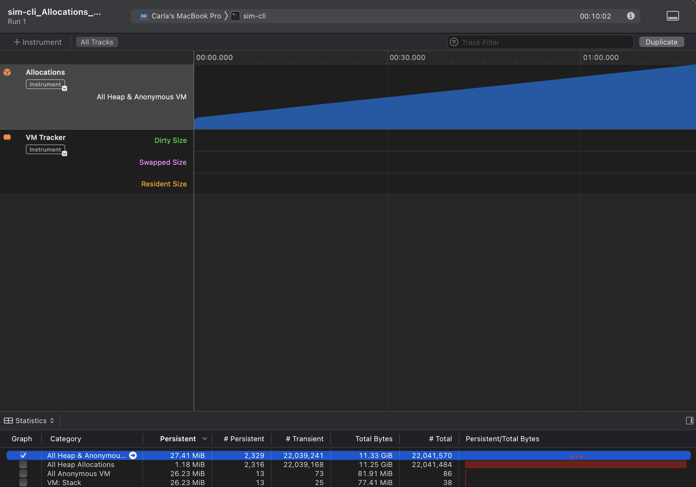
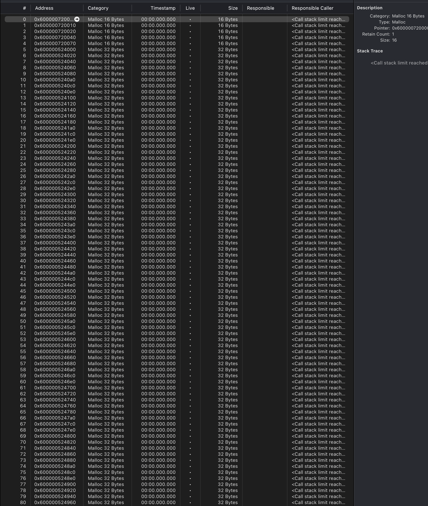
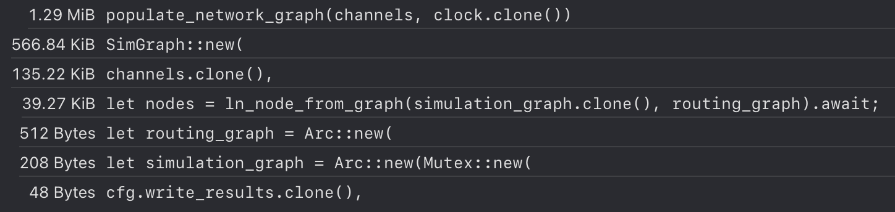
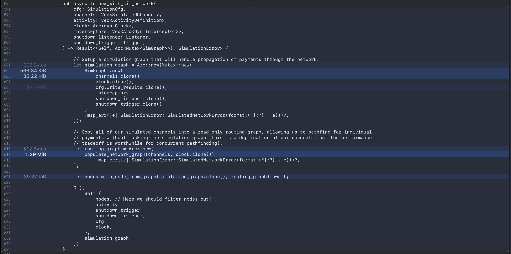
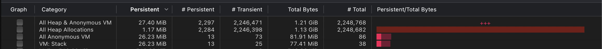
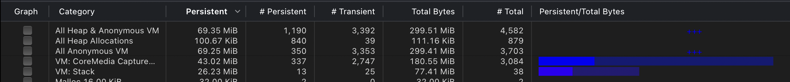
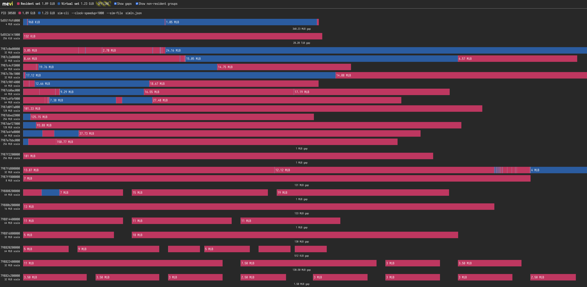
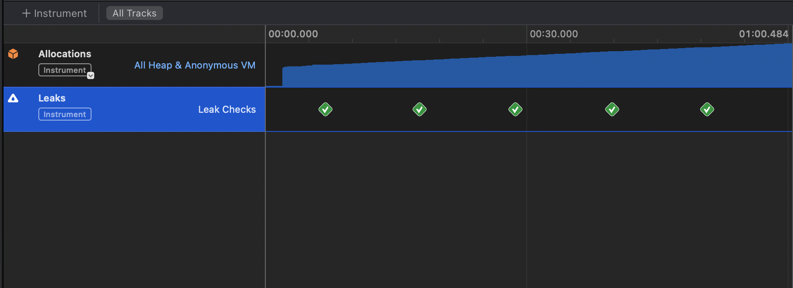
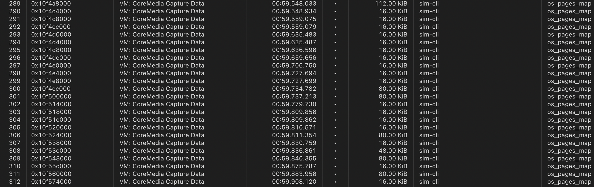

# Profiling Rust (on Mac)

The first program that I wrote in rust was [Sim-LN](https://github.com/bitcoin-dev-project/sim-ln),
network-agnostic a payments simulator for the Lightning Network. I wanted
a reason to learn rust, but I also wanted something memory efficient and
scalable that would be helpful to developers looking for simulations
that are closer to the real world thing than the typical Alice - Bob - Carol
network that we typically test things out on.

Because that's what rust is for. High performance, memory safe, concurrent
systems where resource utilization is top of mind for the "hardcore"
developers who dare tangle with its ownership system. And to feel cool
and have jokes about "rewriting it in rust", a key element of the culture
that I missed out on by starting out with rust straight away.

theme: I wrote a rust program badly because I didn't really understand
ownership, so I used memory profiling to understand where it was getting
yukko.

TODO: statement of what we're doing

## What Sim-LN Does

TODO: description


## Cargo Instruments

[Cargo instruments](https://crates.io/crates/cargo-instruments) works
alongside Mac's app to easily hook up rust programs 

(put this at the end)
## The Mac of it all

Yes, I develop on mac. Yes there are lots of other tools available for
real developers who use linux and compile their bluetooth module by
hand on papyrus so that they can listen to cooler music than me.

The solution for mac is [instruments](https://developer.apple.com/tutorials/instruments?changes=__2),
which ships natively with XCode in Sonoma (which I begrudgingly upgraded
to, then spent half a day fixing up vim colourscheme because it borked
real colours). Instruments is a pretty friendly UI with very unfriendly
errors. After hooking it up to my binary I learned that:
- "Couldn't execute": the binary needs to be debuggable, fair enough.
- "Target binary needs to be signed with get-task-allow": you need to
  use `codesign` to attach some XML "entitlements" to the binary.
- "Failed to attach to process": ChatGPT told me I needed to boot in 
  recovery mode, which seemed extreme.

During my unfruitful GPT-ing and good old fashioned googling, I landed 
on [cargo instruments](https://crates.io/crates/cargo-instruments), 
which is a lovely tool that takes care of all of this for you and drops
your trace in `target/instruments`, which can then be opened up in 
Instruments.

```
cargo instruments -t Allocations --bin sim-cli -- --clock-speedup 1000 --fix-seed 13995354354227336701 -s /Users/carla/Work/jam-ln/data/lvl_acinq/simln_peacetime.json -d /Users/carla/Work/sim-ln/experiments -t 600000
```

After a while I killed the trace, because I could see that memory use
had built up enough for me to get a look at the problem. Instruments
threw me a helpful "Document Missing Template" error, which 
[cargo instruments friendly issue tracker](https://github.com/cmyr/cargo-instruments/issues/99)
helped me realize meant that I'd killed the trace too violently. My
code has a simulation runtime flag, so I added that option, but there's
also a `--time-limit` option in `cargo instruments` which achieves
the same thing.

My logs noted that in this time it sent 300k payments:
```
2025-02-11T14:11:51.845Z INFO  [simln_lib] Processed 377700 payments sending 1065678622158 msat total with 59.68% success rate.
2025-02-11T14:11:51.882Z INFO  [simln_lib] Simulation run for 600000s. Shutting down.
```

Once fixed, my first run gave me this output:



As expected, allocations go up. Much wow.

Taking a close look at the allocations:
- The first 800 note "call stack limit reached"
- After that, I can take a closer look at the stack trace



There's a repeated pattern of cloning a policy and creating a graph
in `new_with_sim_network` when it calls `ChannelPolicy.clone()`.

We can see exactly where these calls are happening thanks to the
stack trace per-allocation:



Clicking into this provides annotated source code that shows us exactly
where the allocations are happening:



We're passing in a vec of `SimulatedChannel` and cloning the whole
thing because we later need to use it to populate our routing graph.
```
    pub async fn new_with_sim_network(
        cfg: SimulationCfg,
        channels: Vec<SimulatedChannel>,
        activity: Vec<ActivityDefinition>,
        clock: Arc<dyn Clock>,
        interceptors: Vec<Arc<dyn Interceptor>>,
        shutdown_listener: Listener,
        shutdown_trigger: Trigger,
    ) -> Result<(Self, Arc<Mutex<SimGraph>>), SimulationError> {

        // Setup a simulation graph that will handle propagation of payments through the network.
        let simulation_graph = Arc::new(Mutex::new(
            SimGraph::new(
                channels.clone(),
                clock.clone(),
                cfg.write_results.clone(),
                interceptors,
                shutdown_listener.clone(),
                shutdown_trigger.clone(),
            )
            .map_err(|e| SimulationError::SimulatedNetworkError(format!("{:?}", e)))?,
        ));

        let routing_graph = Arc::new(
            populate_network_graph(channels, clock.clone())
                .map_err(|e| SimulationError::SimulatedNetworkError(format!("{:?}", e)))?,
        );

```

Things that we can do to clean this up:
- Create the `routing_graph` first, and borrow the channels since
  we're just reading their values into a new struct
- Don't clone the channels use to create `simulation_graph`, because
  we've moved these values anyway in the function call (so we were 
  doubling our memory footprint for the channel graph).

We expect the simulator to have some upfront allocations to set 
everything up - we're creating a set of simulated channels on the heap
and setting up routing graphs for the network.

There's another repetitive pattern of allocations:
- 16 bytes for `ln_node_from_graph`
- 16 bytes to grow a vector
- 240 bytes to create Arc<>

```
nodes.insert(
            *pk,
            Arc::new(Mutex::new(SimNode::new(
                node_info(*pk, info.alias.clone()),
                graph.clone(),
                routing_graph.clone(),
            ))),
        );
```

Things we can do to clean this up:
- Allocate the size of the hashmap in advance because we know how
  many nodes we have, this will save us the allocs to grow the map
  as we go

Next up we have 10.5 Kib cloned, which turns out is just so that we
can run the shutdown handler which is sort of unnecessary.

```
let (sim, sim_network) = create_simulation(&cli).await?;
    let sim2 = sim.clone();
    ctrlc::set_handler(move || {
        log::info!("Shutting down simulation.");
        sim2.shutdown();
    })?;

```

Things we can do to clean this up:
- Pass the shutdown trigger/signal to the simulator, making it easier
  for external callers to handle shutdown (this is nice to have when
  running with a library anyway).

Next there are a whole lot of 368 byte allocations for `thread_start`,
which seem normal. I ran the program for around an hour and took another
look at the allocation trace, nothing looks much different.

### Malloc vs Jemalloc

Next up, I tried running the program using [jemalloc](https://crates.io/crates/jemallocator)

With malloc:



With Jemalloc:


Massive improvement in memory usage with jemalloc, but still ticks up
over time pretty rapidly (in under 10 mins we're approaching 1GB).

So, perhaps it's time to look at memory fragmentation?
- The "Anonymous VM" allocations are likely due to fragmentation

Ran [mevi](https://github.com/fasterthanlime/mevi) and did not find
any evidence of fragmentation:



So the program wasn't freeing memory as well as it should with the
default allocator (likely due to a high degree of concurrency), and
jealloc helped a lot, but memory is still ticking up over time.

Ran a leaks check just in case, but there doesn't seem to be much:



Took a look at things on the tail end of these profiles, because that's
where we'd see things accumulating without any of the memory involved
in our startup.



289/112 Kib
- This hits on `find_payment_route`, unsurprising really because we
  know that we're going to have to build a heap (?) for djikstra
  - In the disassembly code I can see that hep being created

290/16 Kib
- These entries follow `find_payment_route` and are growing a vector
  in the find_route code

300/80 Kib
- These are in sim-ln to spawn tasks in produce_simulation_results

Of these patterns, there's very little we can do about pathfinding.
This is a cost of running a lightning simulator, perhaps it can be
improved with some caching but it's always going to be a big ticket
expense. All of the memory used should also be dropped when we're done
with it.

By contrast, there could be something funny about the tasks that we're
spawning (maybe too many? maybe not cleaning up enough).
- We pipe all of our payment dispatch events into a single channel, 
  and we then need to spawn a task for each one of them
- If we never clear this channel queue (or any channel queue), then
  we could see a buildup of events which will bang up memory
- This seems unlikely to me because track_payment should return very
  fast (as it's a synced LN node), _but_ they're all depending on the
  same lock in the simulated graph so it could be very slow?

The receiver is always okay, but the joinset is forever-growing?
- We weren't reading from the joinset until exit, so the set would grow
  infinitely until the simulation shut down.

Could this possibly be the cause of such big memory blowup? 
What's even in a joinset?
- IdleNotifiedSet<JoinHandle>
- Arc<Mutex<LinkedList<JoinHandle>>> 
  -> So this will be growing, but the size of it depends on the handle
  -> Looks like this is empty? So it shouldn't be much

Turns out that [not releaseing the join handle](https://github.com/tokio-rs/tokio/issues/4406#issuecomment-1014601421)
is the problem!
- While the joinset itself is really small, the memory for the task
  is held !until! the joinset is consumed which leads to our insane
  memory blowup.
- This was a little difficult to see, but evident in the repeated pattern
  where the memory we use for pathfinding was never released (we just
  kept allocating and never deallocating/freeing).

## Back of Envelope

So now that I've eliminated all of the fringe things, time to do a 
better audit of the code and figure out what's going on. Arguably
this should have been done before diving into all the tools, but I did
do a cursory sweep of the codebase and didn't see anything obviously
being allocated where it shouldn't be.

Given that this ticks up over time, there are a few places in the
simulation that we need to look at:
1. Tracking of results in memory to write to disk
2. Sim-Node tracking of virtual channels
3. Sim-LN dispatch of payments (spawns tasks per-payment)

I think that Sim-LN having a bug is the least likely because we've run
it on large clusters before and not seem memory usage blow up (afaik).
Sim-Node is also written mostly solo with one reviewer, so it's a 
higher risk piece of code than Sim-LN.

1. First most obvious port of call:
- We can disable writing results, which will mean that we don't queue
  events in our long-lived writer
- Running with results disabled still has memory climbing up, so it
  can't be that.

2. Next, let's look at Sim-Node

First step is to create a `SimGraph`, for some graph which has:
- N individual nodes
- M channels between the nodes 

Footprint for each N nodes:
- 64 byte public key
- 25 bytes for alias (overhead + 3 chars)
= 89 * N

We store channel capacities in a vector, where each side tracks the
capacity so our footprint for `channel_capacities` is:
- 9 * M * 2
= 18 * M

We also track each node in a `SimNode` so that they can be treated
as individual lightning nodes.
- 64 byte public key
- 25 byte alias
- 4 byte feature vector
= 93 * N

Footprint for each M channels (static, no payments):
- 8 byte short channel ID
- Simulated Channel
  - 8 byte capacity
  - 8 byte short channel ID
  - 2 * (8 + 64 + 25 + 8 + 8 + 8 + 8 + 4 + 8 + 8 + 8) Channel state
  - 1 forward only byte
= 331 * M

For P payments in flight by the simulator, assuming that each payment
is 4 hops on average, tracking htlcs in simulated channel state:
- 32 bytes payment hash 
- 8 byte amount
- 4 byte expiry
- 2 * 12 byte timestamp 
= 272 * P

These are also tracked in `SimNode`:
- 32 byte payment hash
- 8 byte receiver
= 40 * P

Total so far:
(89 + 93) * N + (18 + 331) * M + (272 + 40) * P 

So that really isn't much! To do the whole network, our fixed memory
cost would be: 
= 183*15000 + 360*50000
= 20 MB fixed cost!

Right, so the fundamental types being used aren't that bad. Is there
any information that's being kept around and not discarded?

Calls to the graph are driven by calls to `send_payment`:
- find_payment_route
  - Creates a scorer which is quickly dropped (we shouldn't do this),
    but right now it doesn't have much impact on memory
  - Calls LDK's find_route, which is expected to be expensive but not
    expected to contribute to memory blowup over time?
- dispatch_payment spawns `propagate_payment`:
- add_htlcs: TODO, walkthrough

There are a few obvious places where things can accumulate and not
get smaller:
- `SimNode`: in flight payments used for trackpayment
- `SimulatedChannel`: in flight HTLCs

Quick logging check confirms that these are never much more than 1/2
items in each of these.

Going back to tokio console, it does look like these tasks are cleaning
themselves up / not sticking around a lot?
```
         122029 DONE           60us   34us  541ns   26us 2     task   simln-lib/src/lib.rs:1459:41                          target=tokio::task
         121954 DONE           60us   41us  375ns   18us 2     task   simln-lib/src/lib.rs:1459:41                          target=tokio::task
         121859 DONE           59us   39us  333ns   20us 2     task   simln-lib/src/lib.rs:1459:41                          target=tokio::task
         121772 DONE           59us   40us    4us   15us 3     task   simln-lib/src/lib.rs:1459:41                          target=tokio::task
         122000 DONE           59us   34us  542ns   24us 2     task   simln-lib/src/lib.rs:1459:41                          target=tokio::task
         121781 DONE           58us   43us    4us   11us 3     task   simln-lib/src/lib.rs:1459:41                          target=tokio::task
         121768 DONE           58us   43us  334ns   15us 2     task   simln-lib/src/lib.rs:1459:41                          target=tokio::task
         121916 DONE           58us   43us  417ns   15us 2     task   simln-lib/src/lib.rs:1459:41                          target=tokio::task
```

-> This was also a clue that thigns were building up with the joinset!

## Other Tools
A few, but not all of the tools that I looked into only to discover that
they wouldn't work on my machine:
- [heaptrack](https://github.com/KDE/heaptrack)

Some mac-friendly tools that weren't right for this job, but are still
quite nice:
- [tokio-console](https://github.com/tokio-rs/console): beautiful 
  dashboards for debugging hangs in async programs, minimal installation.
- [pprof crate](https://crates.io/crates/pprof): CPU profiling with
  flamegraphs

## Remember

Must call `track_payment` to delete payments from `in_flight`.
